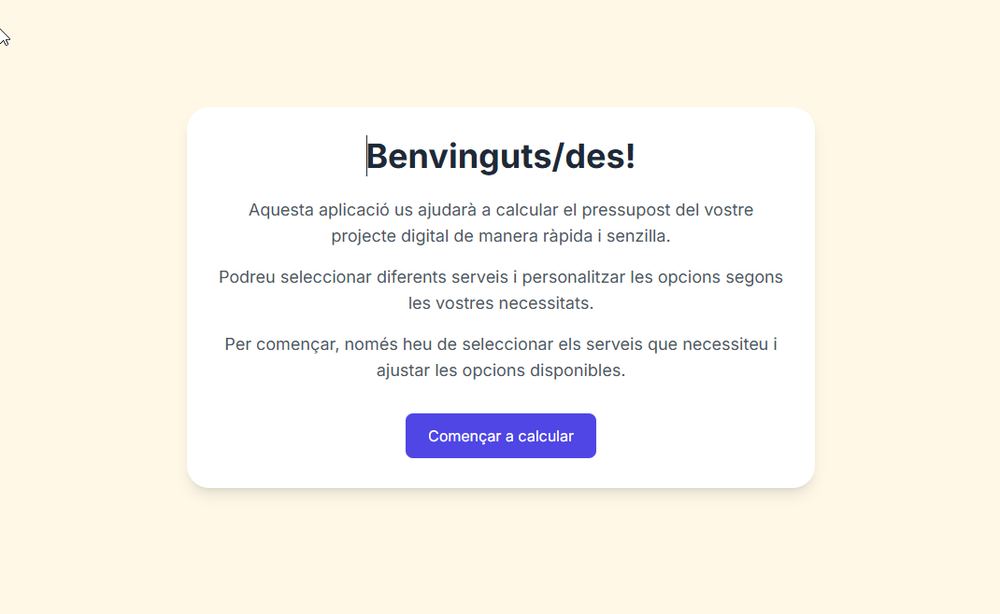
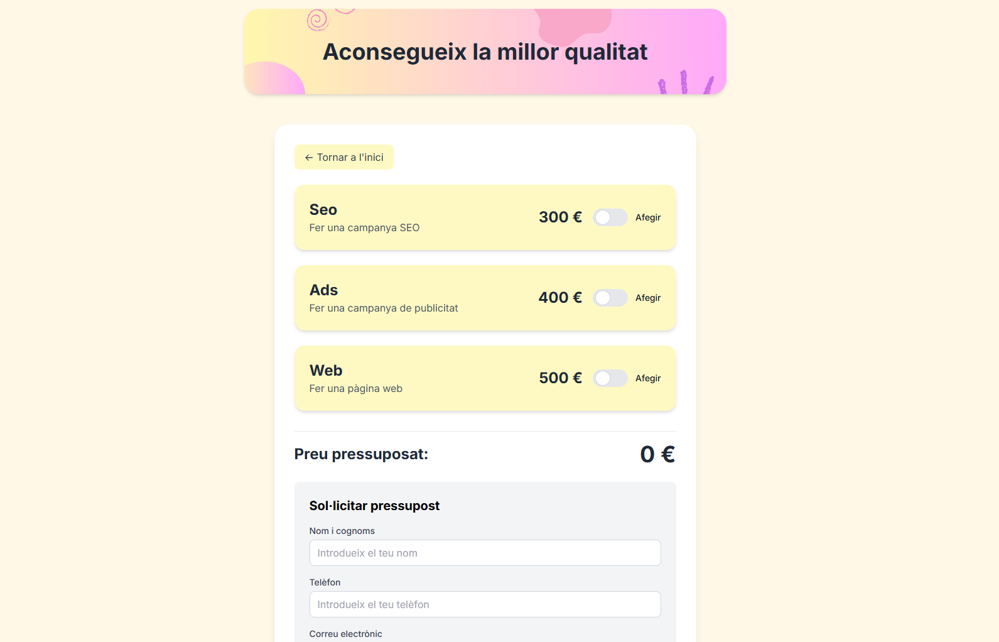
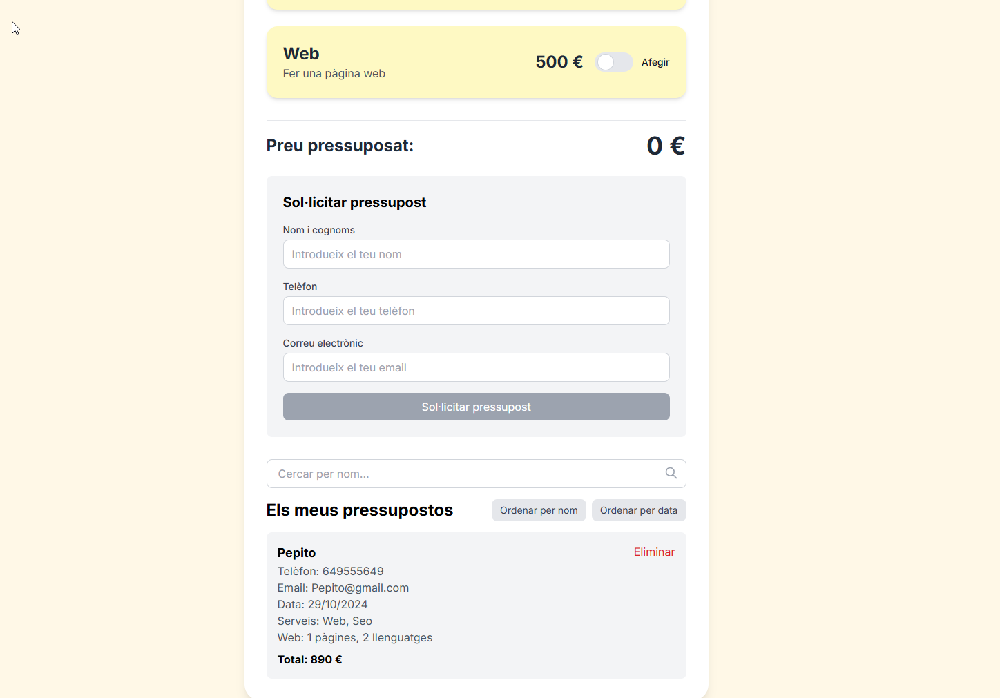

Project to practise React concepts. 

**Project Name 📋: Budget Calculator**

A quick and easy way to estimate your digital project budget.

**Description:** 🚀

This application is designed to help you quickly and easily calculate the budget for your digital project.

**How it works:** ⚙️

Select your services: Choose from a variety of services to include in your project.
Customize options: Tailor your project to your specific needs by adjusting various options.
Get an instant estimate: Receive a detailed breakdown of your estimated costs.

**Technologies Used:** 🛠️

  React: A JavaScript library for building user interfaces.
  Vite: A build tool for frontend development.
  TypeScript: A typed superset of JavaScript.
  Tailwind CSS: A utility-first CSS framework.

**Getting Started:**🔧
  
  # 1. Clone the Repository:
  Bash
  git clone https://github.com/JordiLara/ITACADEMY-6.0-React-ContextHook-Components-Budgets-Project.git
  
  # 2. Install Dependencies:
  Bash
  cd budget-calculator
  npm install

 # 3. Run the Development Server:
  Bash
  npm run dev

*********************************************************************************************************************************************************************************************************************

**Contributing:** 🖇️

This is a repo created to learn, but feel free to fork this repository, make changes, and create pull requests for any improvements or enhancements. Please adhere to the project's coding style and best practices.

